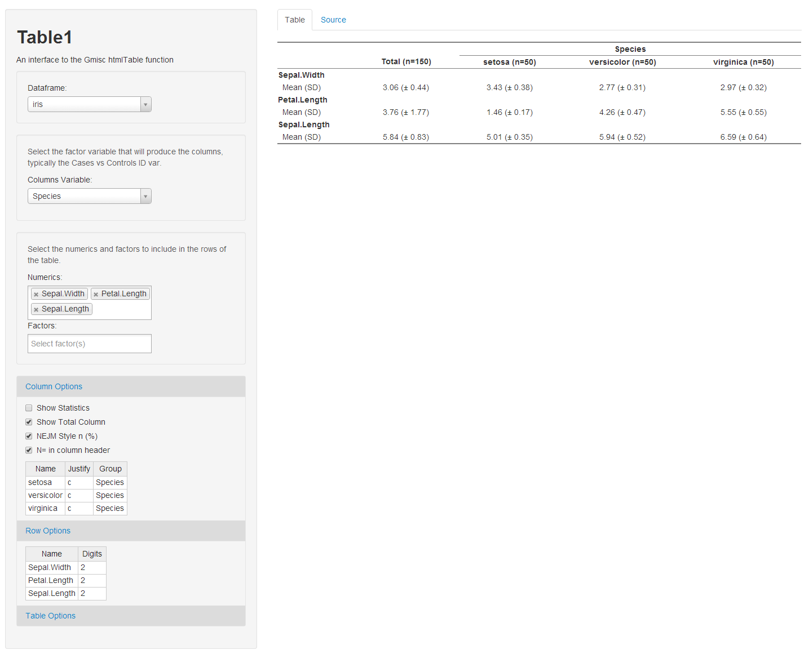

Table1
======

A Shiny based GUI to the htmlTable function of the excellent Gmisc (http://gforge.se/gmisc) package: An interface to select appropriate fields to build a Table 1 (typically used for comparing demographic features of cases/treatment vs control). 



## Instructions

From github:

```
library(shiny)
runGitHub("Table1","dkilfoyle")
```

From downloaded source:

```
shiny:::runApp()
```
